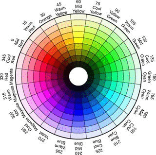

# Control Philips Hue Light

# Setup

# Usage
This package enables users to change lights to change their mood. For example, to encourage the user, do the following:
```
from control_huelight_python import control
control.set_encouragement_mood()
```
Availabilities
-[x] control.set_encouragement_mood()
-[x] control.set_fresh_mood()
-[x] control.set_super_performance_mood()

# Color Temperature Lookup Table
To enable the capability to set a typical LED color while changing the temperature, I use the HSV color space and find the range of H value for ordinary colors i.e. red, yellow, green … This also allows us to change the brightness by changing the V value. Depending on which color space an LED manufacture uses, we can convert from the HSV space to that space. For example, Phillips Hue light bulbs use XY color space. To determine the range of HSV values for each color, I used the following scale
